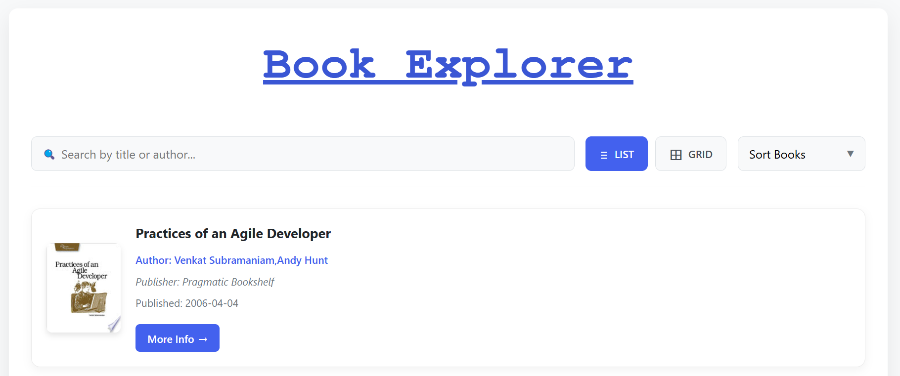
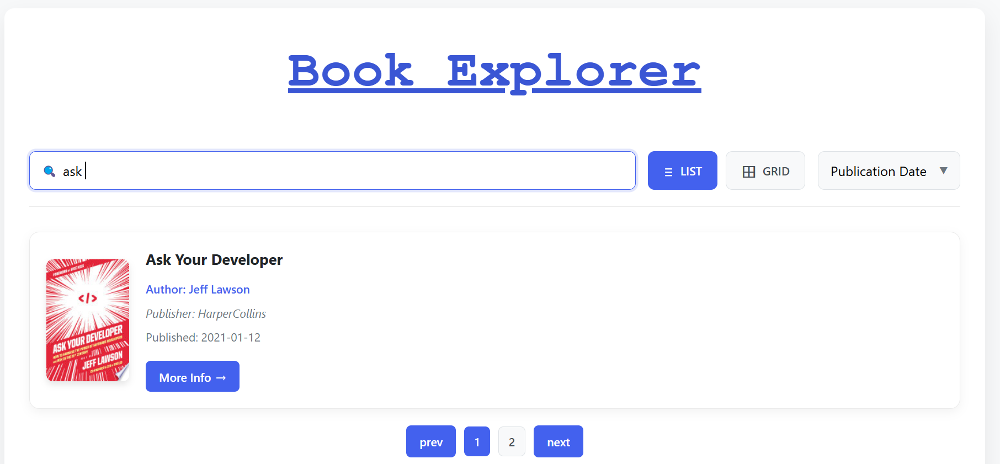

# 📚 Book Explorer

**Book Explorer** is a simple and interactive web application that fetches book data from an API and displays it in either **list view** or **grid view**. Users can **search, sort, and paginate** through the collection.

## 🚀 Features

- 🔍 **Search** books by title or author  
- 🔄 **Sort** books alphabetically (A-Z) or by publication date  
- 🔘 Toggle between **List View** and **Grid View**  
- 📖 **Pagination** for easy navigation  
- 📱 Fully **responsive** design  

---


## 💻 Installation 

1. Clone or download this repository:  
   ```sh
   git clone https://github.com/your-repo/book-explorer.git


## 🌐 API Used

- This project fetches book data from FreeAPI.
- The API response includes book details such as:
- Title
- Author(s)
- Publisher
- Publication Date
- Thumbnail Image


## Screenshot

### Front Look

<p align="center">
  
  <br>
</p>

### Search Filter

<p align="center">
  
  <br>
</p>

### Info Link

<p align="center">
  
  <br>
</p>

